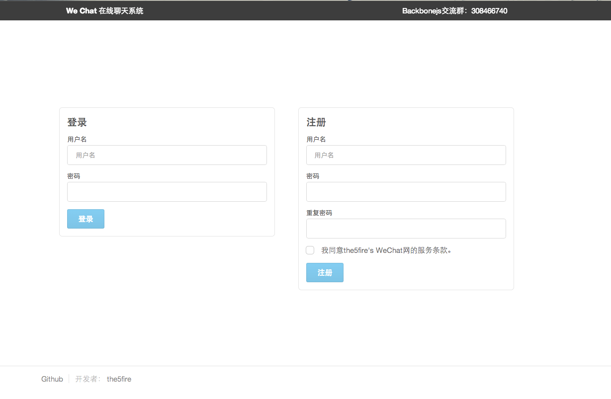
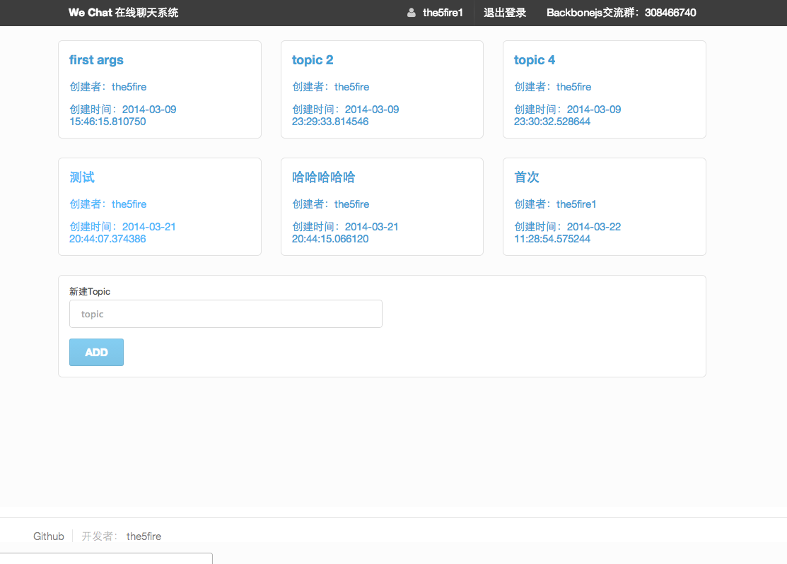
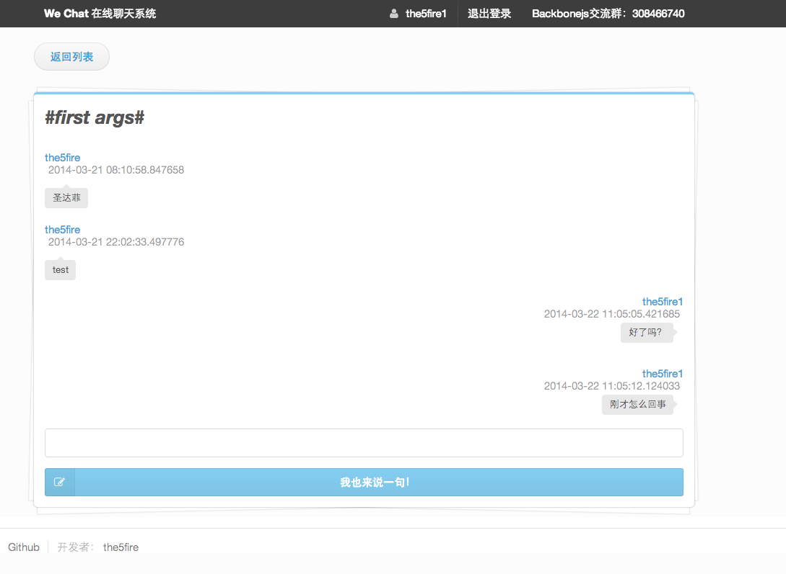

wechat
==================

An online chat room base on backbonejs &amp; webpy &amp; sqlite3

Css styles Power by `semantic <http://zh.semantic-ui.com/>`_ 

Quick Start at local
-------------------------

::

    git clone https://github.com/the5fire/wechat
    cd wechat && pip install -r requirements.txt
    cd src
    python init_sqlite.py
    python server.py

then open your browser and type http://127.0.0.1:8080 .

Quick Deploy Online
------------------------
You should modify hosts/remote_user or other configration in ``deploy-wechat-simple.yml`` first, then::

    ansible-playbook deploy-wechat-simple.yml

that all.

it's running!!

Screenshots
---------------------

login:
~~~~~~~~~~~~~~~~~~~~~~~~

topics:
~~~~~~~~~~~~~~~~~~~~~~~~

messages:
~~~~~~~~~~~~~~~~~~~~

TODO:
------------------------

1. replace gevent-socketio with tornado.
2. use socketio save message data.
